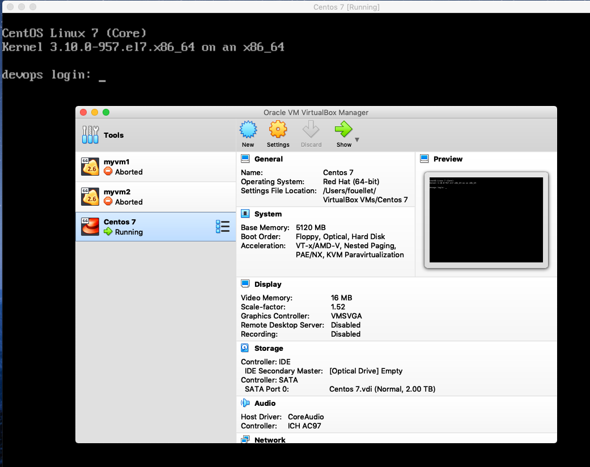
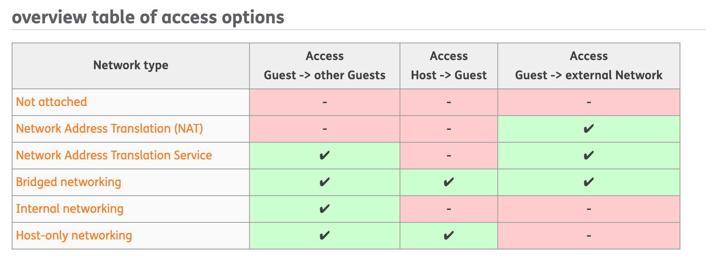
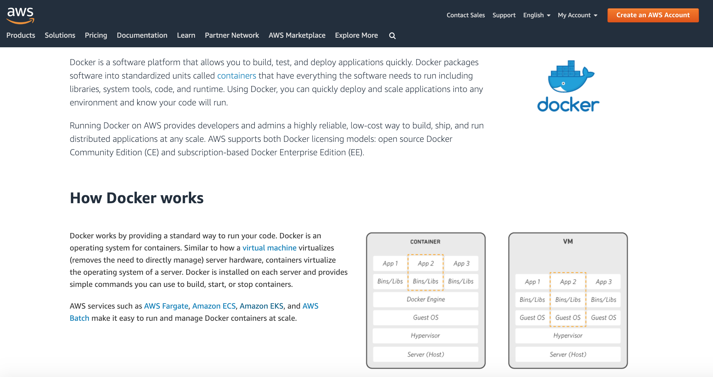

# README

The Pipeline stack project has been created to organize our Continuous Integration and Deployment (CI/CD) pipeline. This stack is composed of GitLab, Jenkins, Nexus and the Application.

Some specification on the stack:

_**Gitlab** is a fully integrated software development platform that enables you and your team to work cohesively, faster, transparently, and effectively, since the discussion of a new idea until taking that idea to production all the way through, from within the same platform._
Reference: [Gitlab Overview](https://docs.gitlab.com/ee/user/index.html#overview)

_**Jenkins** is a self-contained, open source automation server which can be used to automate all sorts of tasks related to building, testing, and delivering or deploying software. Jenkins is a highly extensible product whose functionality can be extended through the installation of plugins._
Reference: [Jenkins](https://jenkins.io/doc/)

_**Nexus** The Nexus platform is all about working with components and repositories. A component is a resource like a library or a framework that is used as part of your software application at run-time, integration or unit test execution time, or required as part of your build process. It could be an entire application or a static resource like an image._
Reference: [Nexus](https://help.sonatype.com/repomanager3/repository-manager-concepts/components%2C-repositories%2C-and-repository-formats)

_**Application** The application server is the final result of our Pipeline processing. It contains Java JRE, Scripts to pull and deploy the application from Nexus. Finally, all we need to make the application running on his own._

## High level diagrams

Simulation of Redhat 7 Virual Machine with VirtualBox Centos 7 guest:


Virtual Machine network type:


Uses containers instead of multiple virtual machines:


## This repository

**um-pipeline**: The source code could be found in svn [here](http://172.21.0.35/svn/wwwCFNAcom/cfna-pipeline/trunk/).

**stack**: Where the containers are built and deploy.

### Set up

We assume that you have already installed Docker on your local machine:
 [docker, docker-compose]. If not I suggest that you read our master [README](../README.md) file. Be aware that we use the latest versions of Docker.

Once you had installed docker, on Windows, MAC, and Linux you could use the script [service.sh](./service.sh). On Windows, you will need to install [Git Bash](https://gitforwindows.org/), followed their instructions.

I have created it to avoid handwriting. Some commands are complexed to type and error-prone. You will find the project in [SVN repo](http://tools.rackspace.com/svn/wwwCFNAcom/cfna-pipeline/trunk/).

Quick overview:

```bash
1. In a terminal, move under the cfan-pipeline/stack project, that you have cloned from SVN repository.
2. Make sure that service.sh file is executable: 
   * > chmod 750 service.sh | chmod +x docker.sh
3. You can use the script to pull images needed for the project. 
   * > ./service.sh pull # Will pull the images we need.
4. Or you can start the stack. It will pull the images automatically.
   * > ./service.sh start stack // it run on the current terminal to see the logs.
   * > ./service.sh stop stack  // you need another terminal to execute it. It does a gracefull shutdown.
```

Some usefuls commands

```bash

1. /service.sh info, Give you information of the swarm, including networking configuration.
2. /service.sh status, Will give you the state of each container.
```

### Contribution guidelines

- Code review: done my collegue, and also by given demos.

### Technical advice

- Use https://cloud.google.com/knative/ a nice to have.

### Resources

- Repo owner: Francis Ouellet <fouellet@dminc.com>
- Community: CFNA team
